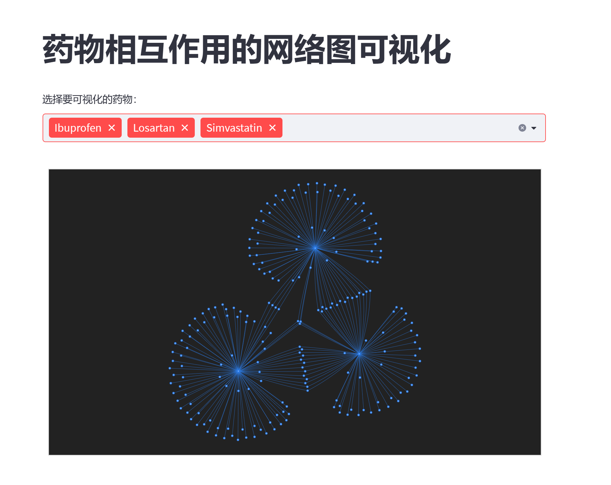

# 朱馨宁的知识图谱工程项目

## 基于鸢尾花数据集的知识图谱项目
本项目展示了一个基于鸢尾花数据集的知识图谱，使用了Streamlit框架进行展示。项目使用了Streamlit和PyGraphviz库来展示一个决策树的可视化图。通过加载鸢尾花数据集，训练了一个决策树分类器，然后将训练好的决策树转换为一个漂亮的图形展示出来。用户可以通过侧边栏来调整图的布局和节点之间的间距。最后，生成一个配置对象，将节点和边的信息传递给一个函数，用于生成决策树的可视化图形。

此外，该项目使用Docker部署将应用程序打包到一个独立的容器中，使其在任何环境中可运行。Dockerfile包含了构建你的应用程序所需的所有步骤，包括依赖项的安装、环境变量的设置等。通过使用Docker命令将这个镜像部署到任何支持Docker的环境中，比如本地开发机、云服务器或者容器编排平台（比如Kubernetes）。这样，应用程序就可以在一个独立的、可移植的容器中运行，而不受底层环境的影响。

### 示例应用
查看基于鸢尾花数据集的示例应用 [基于鸢尾花数据集的知识图谱项目](http://43.156.52.96:8501/)!

### 预览

### 致谢
感谢[ChrisDelClea](https://github.com/ChrisDelClea/streamlit-agraph/commits?author=ChrisDelClea)创建了开源项目[streamlit-agraph](https://github.com/ChrisDelClea/streamlit-agraph)。他们为本项目的大部分内容提供了灵感。

## 基于50W携程出行攻略的顺承事件抽取与事件图谱  
该项目是一个基于50W篇文章领域语料的顺承关系图谱项目。项目包括语料的获取、基于语料的顺承事件挖掘、顺承事件图谱构建和展示等内容。项目形成了包括326781个事件节点和543580条顺承事件对的图谱规模。这个项目包括两个部分：语料的获取和基于语料的事件挖掘。具体的项目目录包括了基于Scrapy的游记采集脚本（news_spider）、基于依存句法与顺承模式的顺承事件抽取脚本（event_graph），以及游记顺承事件图谱的效果图。

顺承事件的抽取包括了对游记文本的输入，长句切分，基于顺承关系模板的前后部分提取，短句处理，谓词性短语提取，谓词性短语向上汇聚，以及滑窗方式构造顺承关系事件对等步骤。而顺承事件图谱的展示则包括了使用VIS插件进行顺承关系图谱的构建与展示，以及在项目中暂时设置到500的顺承图谱的展示。

### 示例应用
查看基于50W携程出行攻略的顺承事件抽取与事件示例应用 [基于50W携程出行攻略的顺承事件抽取与事件图谱](http://43.156.52.96:8080/travel_event_graph.html)!

### 预览
1) 总体图谱样式
以500个顺承事件, 进行顺承事件图谱展示,结果是一张事件网络,这是一个大的顺承关系图谱,由众多子图谱构成  

2) 去丽江子图谱
该子图谱围绕"去丽江旅游"这一出行事件为核心形成的事件群:

3) 飞机路线子图谱 
该子图谱显示了选择飞机进行出行形成的事件序列 

4) 火车路线子图谱
该子图谱显示了选择火车进行出行形成的事件序列

5) 订酒店事件图谱
该子图谱描述了一个"预定酒店不愉快事件",从预定到失望到总结,在这条顺承事件链表现出来

6) 做饭事件图谱
该子图谱表示了一个"做饭"场景下的顺承事件,感觉也很有意思

### 致谢
感谢[liuhuanyong](https://github.com/liuhuanyong/SequentialEventExtration/commits?author=liuhuanyong)创建了开源项目[SequentialEventExtration](https://github.com/liuhuanyong/SequentialEventExtration)。他为本项目的大部分内容提供了灵感。

## 基于药物相互作用的知识图谱项目
这个网站是一个基于streamlit构建的应用，旨在帮助具有临床药学背景的用户探索药物相互作用数据。用户可以通过多选下拉菜单选择不同的药物，然后应用会根据用户的选择构建一个药物相互作用的网络图。这个网络图展示了所选药物之间的相互作用关系，有助于用户理解药物之间的联系以及可能的不良反应。应用还提供了交互式的功能，帮助他们探索药物相互作用数据并应用领域知识进行分析。

### 示例应用
查看基于药物相互作用的示例应用 [基于药物相互作用的知识图谱项目](http://43.156.52.96:8611/)!

### 预览
#### 基于药物相互作用的知识图谱:

#### 基于药物相互作用的知识图谱实例演示:

### 致谢
感谢[Kenneth Leung](https://kennethleungty.medium.com/)创建了开源项目[Pyvis-Network-Graph-Streamli](https://github.com/kennethleungty/Pyvis-Network-Graph-Streamlit)。他们为本项目的大部分内容提供了灵感。

# 论文文献阅读状况汇报

## 文献泛读
近期泛读了一些知识图谱相关的文献，包括自然语言处理系统的语义能力、知识图谱在互联网时代的应用、大数据对生活和工作的影响、知识图谱概念划分方法、知识图谱在企业信息系统中的应用以及智能学习技术在地质数据知识图谱构建中的应用。这些研究成果涵盖了知识图谱的概念发展、关键技术和应用领域，对理解和应用知识图谱提供了有益的见解，具体文献如下：
| 文献名称（Literature title）                                                                                                    | 标签(Tags)               | 概述(Overview)                                        | 时间(Time)  | 期刊/出版社/会议名称（Journal/publisher/conference title）                                           |
|---------------------------------------------------------------------------------------------------------------------------------|-------------------------|-------------------------------------------------------|-------------|--------------------------------------------------------------------------------------------------|
| Word concepts: a theory and simulation of some basic semantic capabilities                                                         | [概念发展][期刊文章]      | 理解自然语言处理系统基本语义能力的理论基础               | Sep-67      | Behavioral Science                                                                                |
| Semantics empowered Web 3. 0: managing enterprise, social, sensor, and cloud-based data and services for advanced applications | [概念发展][图书]         | 知识图谱在互联网时代的作用与意义                       | 2013        | Springer International Publishing                                                                |
| Big data: a revolution that will transform how we live, work and think                                                           | [概念发展][图书]         | 知识图谱对于工程行业的意义                             | 2013/8/1    | Choice Reviews Online                                                                            |
| Ontology-aware partitioning for knowledge graph identification                                                                    | [概念发展][会议论文]      | 知识图谱概念划分                                       | 2013/10/27  | CIKM'13: 22nd ACM International Conference on Information and Knowledge Management                 |
| Enterprise knowledge graphs: a semantic approach for knowledge management in the next generation of enterprise information systems | [应用][会议论文]          | 知识图谱在工业信息系统的应用                             | 2017        | 19th International Conference on Enterprise Information Systems                                |
| Intelligent learning for knowledge graph towards geological data                                                                 | [关键技术][期刊文章]      | 利用智能学习技术构建知识图谱的方法                     | 2017        | Scientific Programming                                                                           |
| Constructing biomedical domain-specific knowledge graph with minimum supervision                                                  | [关键技术][期刊文章]      | 以最少监督的方式构建领域特定知识图谱                   |             | Knowledge and Information Systems                                                               |
| Anticipating stock market of the renowned companies: a knowledge graph approach                                                  | [应用][期刊文章]          | 知识图谱在金融应用中的应用                             | 2019/8/7    | Complexity                                                                                       |
| A method for systematically developing the knowledge base of reactor operators in nuclear power plants to support cognitive modeling of operator performance                                          | [应用][期刊文章]          | 知识图谱在认知建模的应用                               | Jun-19      | Reliability Engineering & System Safety                                                         |
| A knowledge graph-aided concept–knowledge approach for evolutionary smart product–service system development                     | [应用][期刊文章]          | 知识图谱在智能产品-服务系统开发中的应用                 | 2020/10/1   | Journal of Mechanical Design                                                                     |
| Research on the Development of Text Mining Technology based on Bibliometrics and Knowledge Map Visualization                      | [航空应用][关键概念][期刊文章] | 基于知识图谱可视化的文本挖掘技术                         | 2017        | Scientific Journal of Information Engineering                                                    |
| Minimally-supervised extraction of entities from text advertisement                                                               | [关键技术][会议论文]      | 最小监督下的文本广告实体抽取方法                         | 2010        | Human Language Technologies: The 2010 Annual Conference of the North American Chapter of the Association for Computational Linguistics |
| Named-entity recognition on Indonesian tweets using bidirectional LSTM-CRF                                                        | [关键技术][期刊文章]      | 深度学习进行命名实体识别                                 | 2019        | Procedia Computer Science                                                                         |
| Structured prediction models for RNN-based sequence labeling in clinical text                                                     | [关键技术][会议论文]      | 深度学习进行序列标注任务                                 | 2016        | NIH Public Access                                                                                |
| A comparative analysis of methodologies for database schema integration                                                           | [关键技术][期刊文章]      | 基于模式匹配的关系抽取                                   | 1986/12/11  | ACM Computing Surveys                                                                            |
| A survey on recent named entity recognition and relationship extraction techniques on clinical texts                              | [关键技术][期刊文章]      | 基于模式匹配的关系抽取                                   | 2021        | Applied Sciences                                                                                 |
| Unsupervised feature selection for relation extraction                                                                           | [关键技术][会议论文]      | 基于统计学习的关系抽取                                   | 2005        | Companion Volume to the Proceedings of Conference including Posters/Demos and tutorial abstracts |
| Relation classification via target-concentrated attention CNNs                                                                  | [关键技术][会议论文]      | 基于深度学习的关系抽取                                   | 2017        | Neural Information Processing: 24th International Conference, ICONIP 2017, Guangzhou, China, November 14-18, 2017, Proceedings, Part II 24 |
| A framework for ro-bust discovery of entity synonyms                                                                             | [航空应用][会议论文]      | 知识融合的经典模型                                       | 2012/8/12   | KDD '12: The 18th ACM SIGKDD International Conference on Knowledge Discovery and Data Mining     |
| A Bayesian decision model for cost optimal record matching                                                                       | [航空应用][期刊文章]      | 知识融合的经典模型                                       | 2003/5/1    | The VLDB Journal The International Journal on Very Large Data Bases                              |
| Deep learning for entity matching: a design space exploration                                                                    | [航空应用][会议论文]      | 知识融合的经典模型                                       | 2018/5/27   | SIGMOD/PODS '18: International Conference on Management of Data                                  |
| An automatic method for constructing machining process knowledge base from knowledge graph                                       | [工艺知识][期刊文章]      | 自动构建加工工艺知识库的方法                             | Feb-22      | Robotics and Computer-Integrated Manufacturing                                                    |
| Knowledge graph-based manufacturing process planning: A state-of-the-art review                                                  | [工艺知识][期刊文章]      | 基于知识图谱的制造过程规划研究                           | Oct-23      | Journal of Manufacturing Systems                                                                 |
| KnowIME: A System to Construct a Knowledge Graph for Intelligent Manufacturing Equipment                                              | [工艺知识][期刊文章]      | 用于构建智能制造设备知识图谱的系统                     | 2020         | IEEE Access                                                                                    |
| A graph-based meta-model for heterogeneous data management                                                                           | [多元模型][期刊文章]      | 基于图形模型的异构数据管理元模型                     | Oct-19       | Knowledge and Information Systems                                                             |
| Structured modeling of heterogeneous CAM model based on process knowledge graph                                                     | [多元模型][期刊文章]      | 基于工艺知识图谱的异构CAM模型结构化建模方法          | Jun-18       | The International Journal of Advanced Manufacturing Technology                                |
| A novel knowledge graph-based optimization approach for resource allocation in discrete manufacturing workshops                      | [工艺知识][期刊文章]      | 基于知识图谱的离散制造车间资源分配优化方法           | Oct-21       | Robotics and Computer-Integrated Manufacturing                                                 |
| Towards Self-X cognitive manufacturing network: An industrial knowledge graph-based multi-agent reinforcement learning approach      | [多元模型][期刊文章]      | 基于知识图谱的多智能体强化学习方法                   | Oct-21       | Journal of Manufacturing Systems                                                              |
| Data-driven ontology generation and evolution towards intelligent service in manufacturing systems                                 | [工艺知识][期刊文章]      | 基于数据驱动的本体构建方法                           | Dec-19       | Future Generation Computer Systems                                                            |
| Sakr_Awad_2010_A framework for querying graph-based business process models.pdf                                                     | [多元模型][会议论文]      | 基于图形模型的业务流程模型查询框架                   | 2010/4/26    | Proceedings of the 19th international conference on World wide web                            |
| Smart Condition Monitoring for Industry 4.0 Manufacturing Processes: An Ontology-Based Approach                                     | [多元模型][期刊文章]      | 基于本体的智能制造过程智能监测方法                   | 2019/2/17    | Cybernetics and Systems        

## 相应文献泛读概述

此外，精读了其中几篇文献。其中，对一些文章进行了简短的总结，并记录了相应的启发，以下是一些拙见：

**Deep Learning for Entity Matching: A Design Space Exploration**

**文章概述**：这篇文章主要探讨了实体匹配中深度学习（Deep Learning）的应用及效果。文中首先对深度学习在实体匹配中的应用进行了概述，随后详细介绍了四种具有不同表示能力的深度学习解决方案：SIF，RNN，Attention和Hybrid。接着，文章分析了深度学习在解决不同类型的实体匹配问题时的优势，包括结构化数据、文本和“脏”数据的情况。通过与当前最佳的实体匹配解决方案进行比较，结果表明深度学习在解决文本和“脏”数据的实体匹配问题时表现优异，但在处理结构化数据时效果并不理想。文章最后讨论了深度学习的性能并指出了未来的研究方向。
**启发**：实体匹配是一种寻找同一现实世界实体所对应的数据实例的技术，在航天航空领域中具有应用价值。尽管深度学习在解决结构化数据的实体匹配问题上还没有取得明显的优势，但在处理文本数据和脏数据方面，深度学习仍然展现出了巨大的潜力。因此，未来可以进一步探索深度学习在航天航空领域中的应用，特别是在处理遥感数据、气象数据等文本实例和脏实例的问题上。

**Enterprise Knowledge Graphs: A Semantic Approach for Knowledge Management in the Next Generation of Enterprise Information Systems**

**文章概述**：本文主要探讨了企业知识图谱（EKG）的概念，这是一种用于表示和管理企业信息系统的语义层面信息的正式模型。文章还探讨了使用语义网技术和关联企业数据（LED）的方法，以将语义技术的优势融入企业IT环境中。此外，文章还对现有的EIS进行了评估研究，以确定和可视化具有相同EKG特征的群体，这突显了在新一代EIS中开发这些功能的必要性。
**启发**：在构建大型知识图谱时，需要充分利用现有的大规模开放数据源（如Wikidata）来提高知识的准确性和丰富性。知识图谱不仅可以用于企业数据管理和知识共享，还可以用于支持决策、智能问答、语义搜索等应用场景。在航空航天领域进行知识图谱研究时，可以充分利用现代计算机科学技术，包括本体建模、规则推理、大数据分析、机器学习和人工智能、语义网和知识图谱的融合以及可视化技术等，以实现准确、高效的知识表示和推理。

**Research on the Development of Text Mining Technology based on Bibliometrics and Knowledge Map Visualization**

**文章概述**：文本挖掘是一个从文本数据中提取潜在信息和发现文本知识的过程。本文利用文献计量分析方法，借助Bicomb的文献计量函数、Ucinet的社会网络分析函数、SPSS的统计分析函数以及Netdraw、Citespace的可视化分析函数，从文献分布、期刊分布、高产作者合作、机构合作、研究热点和研究前沿等方面，呈现了文本挖掘研究现状。

**启发**：文本挖掘是一种强大的工具，可以帮助航空航天领域的研究者从大量的非结构化和半结构化数据中提取有价值的信息。通过对航空航天领域的文献进行文本挖掘，可以更好地理解该领域的发展趋势、技术瓶颈、创新机会等关键信息。此外，文本挖掘还可以帮助发现潜在的合作机会、确定竞争对手以及评估市场风险等。在面对海量的航空航天领域数据时，文本挖掘将是一种非常有价值的工具，可以帮助更快、更准确地获取所需信息。

**Word Concepts: A Theory and Simulation of Some Basic Semantic Capabilities**

**文章概述**：文章讨论了模拟人类语言行为的计算机模型存储器的开发。该模型存储器是通过将字典中的信息重新编码为复杂的元素和关联网络而创建的。使用该模型存储器的程序能够比较和对比英语单词的含义、进行推理并表达结论。文章还介绍了记忆模型中使用的设计原则和方法，这些原则和方法为人类如何格式化、组织和使用语义和概念材料的记忆提供了启示。

**启发**：在模型记忆中使用复杂的网络和关联可以使用知识图谱的设计，用于捕获和组织航空航天领域的语义和概念信息。通过比较和对比单词的含义、得出推论并表达结论，知识图谱可被应用于基于语言的任务，如航空航天研究中的文本分析或信息检索。

**Ontology-aware partitioning for knowledge graph identification**

**文章概述**：文章讨论了从噪声提取中构建知识图谱所面临的挑战，并介绍了一种称为知识图谱识别（KGI）的技术，用于构建一致的知识图谱。作者探讨了 KGI 的可扩展性，并提出了一种利用本体信息和分布信息提高性能的分区方法。他们将自己的方法与基于哈希值的分区方法进行了比较，结果表明，使用本体感知分区模型能带来更好的效果。

**启发**：知识图谱识别（KGI）技术被提出来构建一致性的知识图谱，并解决了从嘈杂的数据中构建知识图谱的挑战。在航天航空领域中考虑采用KGI技术来处理嘈杂的数据，并利用实体解析来提高实体识别的准确性。采用本体感知的分区方法可以更好地处理大规模的知识图谱构建任务。
