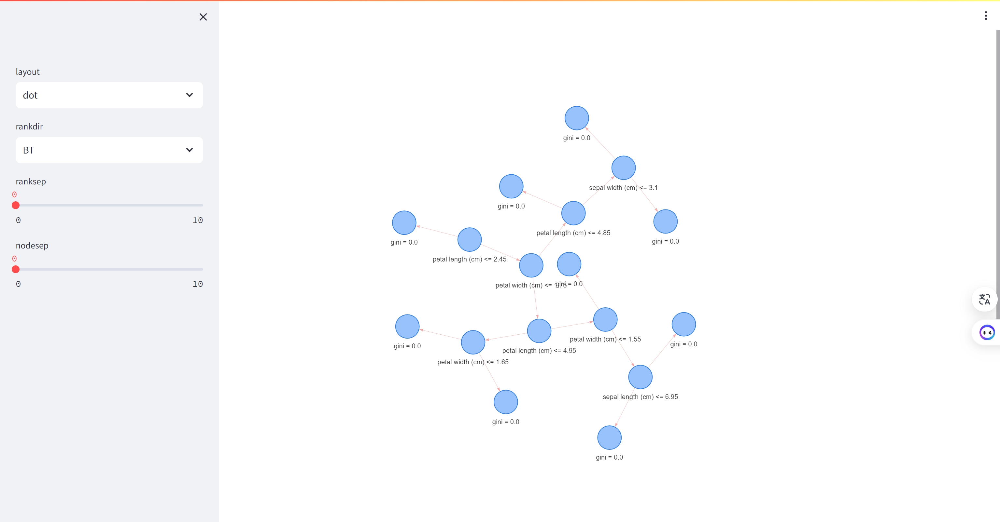
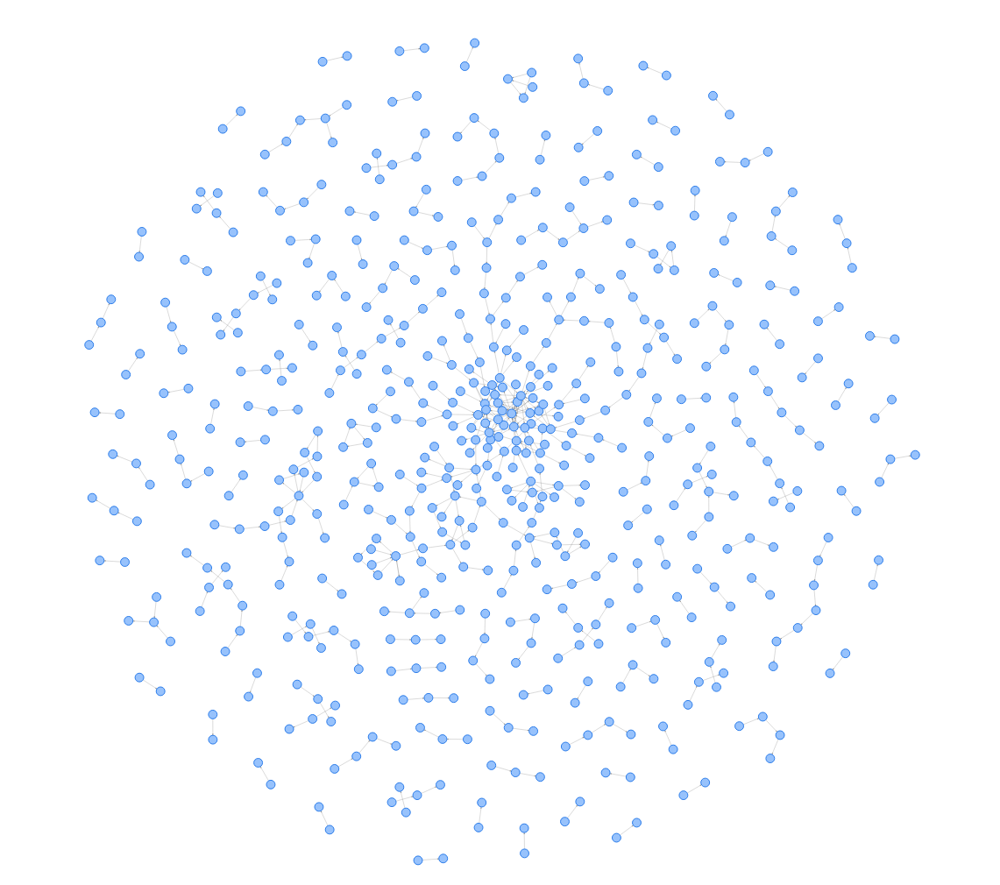
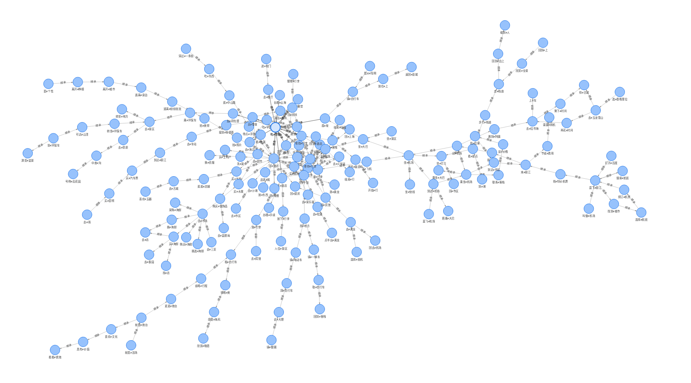
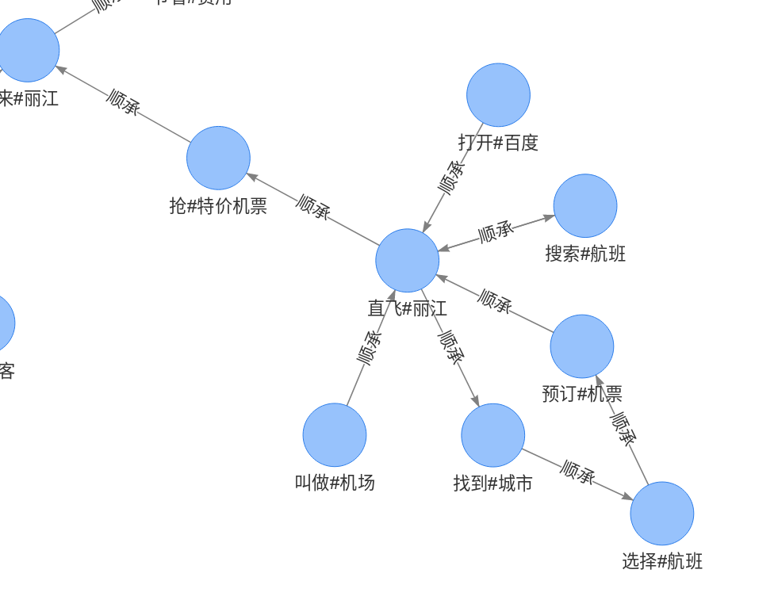
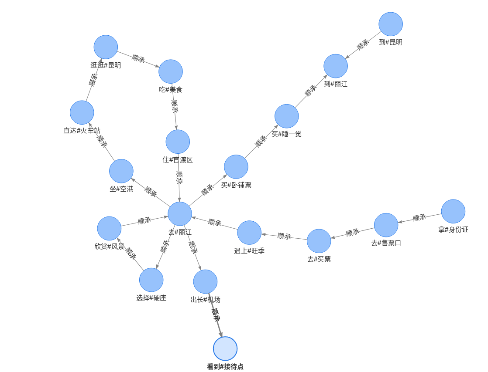
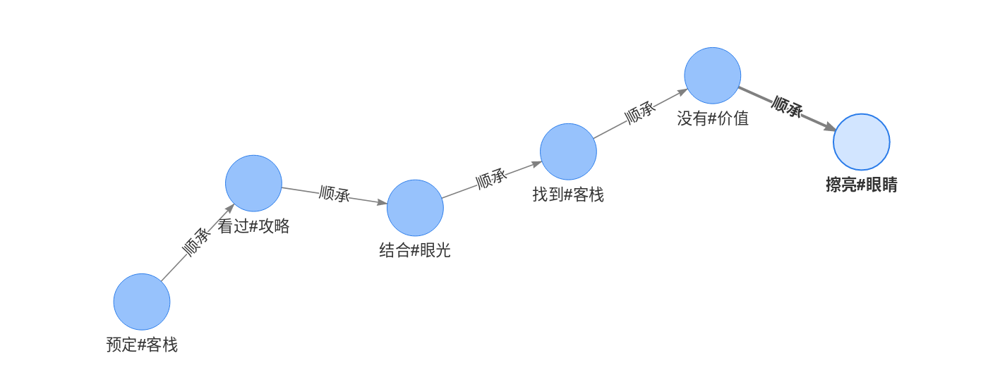
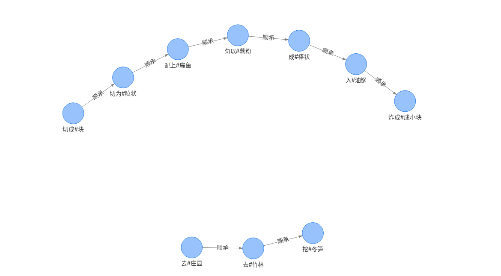

# 朱馨宁的知识图谱工程项目

## 基于鸢尾花数据集的知识图谱项目
本项目展示了一个基于鸢尾花数据集的知识图谱，使用了Streamlit框架进行展示。项目使用了Streamlit和PyGraphviz库来展示一个决策树的可视化图。通过加载鸢尾花数据集，训练了一个决策树分类器，然后将训练好的决策树转换为一个漂亮的图形展示出来。用户可以通过侧边栏来调整图的布局和节点之间的间距。最后，生成一个配置对象，将节点和边的信息传递给一个函数，用于生成决策树的可视化图形。

此外，该项目使用Docker部署将应用程序打包到一个独立的容器中，使其在任何环境中可运行。Dockerfile包含了构建你的应用程序所需的所有步骤，包括依赖项的安装、环境变量的设置等。通过使用Docker命令将这个镜像部署到任何支持Docker的环境中，比如本地开发机、云服务器或者容器编排平台（比如Kubernetes）。这样，应用程序就可以在一个独立的、可移植的容器中运行，而不受底层环境的影响。

### 示例应用
查看示例应用 [App](http://43.156.52.96:8501/)!

### 预览

### 致谢
感谢[ChrisDelClea](https://github.com/ChrisDelClea/streamlit-agraph/commits?author=ChrisDelClea)创建了开源项目[streamlit-agraph](https://github.com/ChrisDelClea/streamlit-agraph)。他们为本项目的大部分内容提供了灵感。

## 基于50W携程出行攻略的顺承事件抽取与事件图谱  
该项目是一个基于50W篇文章领域语料的顺承关系图谱项目。项目包括语料的获取、基于语料的顺承事件挖掘、顺承事件图谱构建和展示等内容。项目形成了包括326781个事件节点和543580条顺承事件对的图谱规模。这个项目包括两个部分：语料的获取和基于语料的事件挖掘。具体的项目目录包括了基于Scrapy的游记采集脚本（news_spider）、基于依存句法与顺承模式的顺承事件抽取脚本（event_graph），以及游记顺承事件图谱的效果图。

顺承事件的抽取包括了对游记文本的输入，长句切分，基于顺承关系模板的前后部分提取，短句处理，谓词性短语提取，谓词性短语向上汇聚，以及滑窗方式构造顺承关系事件对等步骤。而顺承事件图谱的展示则包括了使用VIS插件进行顺承关系图谱的构建与展示，以及在项目中暂时设置到500的顺承图谱的展示。

### 示例应用
查看示例应用 [App](http://43.156.52.96:8080/travel_event_graph.html)!

### 预览
# 1) 总体图谱样式
以500个顺承事件, 进行顺承事件图谱展示,结果是一张事件网络,这是一个大的顺承关系图谱,由众多子图谱构成  

# 2) 去丽江子图谱
该子图谱围绕"去丽江旅游"这一出行事件为核心形成的事件群:

# 3) 飞机路线子图谱 
该子图谱显示了选择飞机进行出行形成的事件序列 

# 4) 火车路线子图谱
该子图谱显示了选择火车进行出行形成的事件序列

# 5) 订酒店事件图谱
该子图谱描述了一个"预定酒店不愉快事件",从预定到失望到总结,在这条顺承事件链表现出来

# 6) 做饭事件图谱
该子图谱表示了一个"做饭"场景下的顺承事件,感觉也很有意思

### 致谢
感谢[liuhuanyong](https://github.com/liuhuanyong/SequentialEventExtration/commits?author=liuhuanyong)创建了开源项目[SequentialEventExtration](https://github.com/liuhuanyong/SequentialEventExtration)。他为本项目的大部分内容提供了灵感。