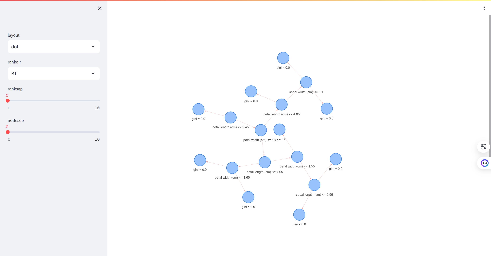

# 朱馨宁的知识图谱工程项目

## 基于鸢尾花数据集的知识图谱项目
本项目展示了一个基于鸢尾花数据集的知识图谱，使用了Streamlit框架进行展示。项目使用了Streamlit和PyGraphviz库来展示一个决策树的可视化图。通过加载鸢尾花数据集，训练了一个决策树分类器，然后将训练好的决策树转换为一个漂亮的图形展示出来。用户可以通过侧边栏来调整图的布局和节点之间的间距。最后，生成一个配置对象，将节点和边的信息传递给一个函数，用于生成决策树的可视化图形。

此外，该项目使用Docker部署将应用程序打包到一个独立的容器中，使其在任何环境中可运行。Dockerfile包含了构建你的应用程序所需的所有步骤，包括依赖项的安装、环境变量的设置等。通过使用Docker命令将这个镜像部署到任何支持Docker的环境中，比如本地开发机、云服务器或者容器编排平台（比如Kubernetes）。这样，应用程序就可以在一个独立的、可移植的容器中运行，而不受底层环境的影响。

## 示例应用
查看示例应用 [App](http://43.156.52.96:8501/)!

## 预览

## 致谢
感谢[ChrisDelClea](https://github.com/ChrisDelClea/streamlit-agraph/commits?author=ChrisDelClea)创建了开源项目[streamlit-agraph](https://github.com/ChrisDelClea/streamlit-agraph)。他们为本项目的大部分内容提供了灵感。